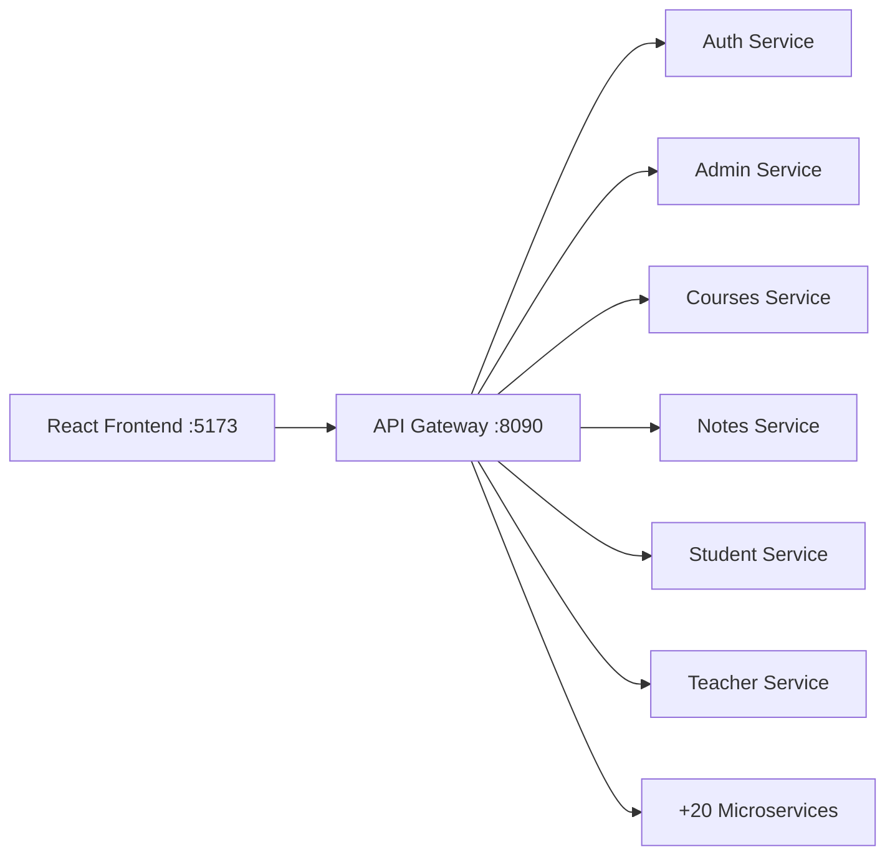

# 🎓 ETEC University — Frontend

**University management platform** — Modern React frontend for managing students, teachers, courses, grades, attendance, and administration at the School of Technology and Commerce (ETEC).

---

## ✨ Overview

| Section | Description |
|---------|-------------|
| 🏠 **Public pages** | Home, programs, news, contact, admissions |
| 🔐 **Authentication** | Login/register with roles: Admin · Teacher · Student |
| 🧑‍💼 **Admin Dashboard** | User management, programs, grades, schedules, news, slides |
| 👨‍🏫 **Teacher Dashboard** | Courses, evaluations, resources, notifications, messaging |
| 👨‍🎓 **Student Dashboard** | Online courses, grades, schedule, progress, quizzes |
| 🌐 **i18n** | Multilingual: French · English · Malagasy |

---

## 🧱 Architecture

```
src/
├── assets/              # Images, icons, fonts
├── components/          # Reusable UI components
├── config/              # i18n, providers
├── context/             # React context (theme, language)
├── feature/             # Feature modules (auth, news, events)
├── hooks/               # Custom hooks (useTranslation)
├── layouts/             # Dashboard layouts
│   ├── DashbordAdmin/
│   ├── DashboardEnseignants/
│   └── DashboardEtud/
├── locales/             # Translations (en, fr, mg)
├── pages/               # Public pages
├── routes/              # Route configuration
├── services/            # API client (axios, ApiService)
├── styles/              # Global CSS
├── types/               # TypeScript types
└── utils/               # Utility functions
```

---

## 🛠️ Tech Stack

| Technology | Version |
|------------|---------|
| [React](https://react.dev) | 19.2 |
| [Vite](https://vitejs.dev) | 8.0 |
| [TypeScript](https://www.typescriptlang.org) | ~5.8 |
| [Tailwind CSS](https://tailwindcss.com) | 4.3 |
| [React Router](https://reactrouter.com) | 7.18 |
| [Axios](https://axios-http.com) | 1.18 |
| [Framer Motion](https://www.framer.com/motion) | 12.40 |
| [i18next](https://www.i18next.com) | 26.3 |
| [Recharts](https://recharts.org) | 3.9 |
| [Lucide React](https://lucide.dev) | 1.21 |
| [ESLint](https://eslint.org) | 10.3 |

---

## 🚀 Quick Start

### Prerequisites

- **Node.js** ≥ 22
- **npm** ≥ 10
- ETEC Backend running (see [backend](../backend))

### Installation

```bash
git clone https://github.com/tahiry-dev-29/SIteEtec.git
cd SIteEtec/frontend

npm install
npm run dev
```

### Available Scripts

| Command | Description |
|---------|-------------|
| `npm run dev` | Start dev server on port 5173 |
| `npm run build` | Build for production into `dist/` |
| `npm run preview` | Preview the production build |
| `npm run lint` | Run ESLint checks |

### Configuration

```env
# .env.local
VITE_API_GATEWAY_URL=http://localhost:8090
```

---

## 🔌 API & Backend



The frontend communicates with the Spring Boot **API Gateway** (port `8090`) which routes requests to backend microservices.

### Connected Services

| Service | Gateway Endpoint | Microservice |
|---------|-----------------|--------------|
| Authentication | `/auth/**` | `utilisateur` |
| Admins | `/api/admins` | `admin` |
| Students | `/api/etudiants` | `etudiant` |
| Teachers | `/api/enseignants` | `enseignant` |
| Online courses | `/api/cours` | `coursenligne` |
| News | `/api/actualites` | `actualite` |
| Grades | `/api/notes` | `note` |
| Schedules | `/api/emploiDuTemps` | `empoiDuTemps` |
| +20 more services | … | … |

> 📖 See the [backend README](../backend/README.md) for the full list.

---

## 🌍 Internationalization

The project supports 3 languages via `i18next`:

| Language | File |
|----------|------|
| 🇫🇷 French | `src/locales/fr/common.json` |
| 🇬🇧 English | `src/locales/en/common.json` |
| 🇲🇬 Malagasy | `src/locales/mg/common.json` |

Language switching is handled by the `LanguageSwitcher` component in the `TopBar`.

---

## 👨‍💻 Development

### Conventions

- **Components**: Functional with hooks (`useState`, `useEffect`)
- **State management**: Context API + localStorage for auth
- **API**: `ApiService.ts` centralizes all axios calls
- **Routes**: Defined in `src/routes/AppRoutes.tsx`
- **Styles**: Tailwind CSS utility-first

### Dashboard Structure

```
layouts/
├── DashbordAdmin/          # Full CRUD for each entity
├── DashboardEnseignants/   # Courses, evaluations, resources
└── DashboardEtud/          # Online courses, grades, progress
```

---

## 🤝 Contributing

1. Create a feature branch: `git checkout -b feat/my-feature`
2. Commit using [Conventional Commits](https://www.conventionalcommits.org)
3. Open a Pull Request to `main`

---

## 📄 License

Private project — ETEC University
